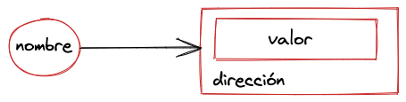

# Unidad IV

## Tipos, Valores y Variables

Los programas de computadoras funcionan manipulando ***valores*** (values), tal como 2.78 o el texto "Hola Mundo". 

Cuando un programa necesita retener un valor para su futuro uso, este asigna el valor a (o almacena el valor en) una ***variable*** y su valor puede cambiar durante la ejecución del programa tantas veces como sea necesario. Una variable define un nombre simbólico para un valor y permite que el valor sea referido mediante el nombre. La manera en que las variables trabajan es otra característica fundamental de cualquier lenguaje de programación. 

  

Los tipos de valores que pueden ser representados y manipulados en un lenguaje de programación son conocidos como ***tipos de datos*** (data types), y una de las características más importantes de un lenguaje de programación es el conjunto de tipos que este soporta. Los tipos de datos determinan los valores que puede tomar una variable y las operaciones que pueden realizarse con ella, por ejemplo, una variable de tipo entero sólo podrá almacenar números enteros y se podrán aplicar operaciones que admiten los enteros, como la suma, multiplicación, etc.

## Constantes

Una ***constante*** es una variable, es decir, un lugar donde podemos almacenar un valor al cual accedemos mediante un nombre, pero con la garantía de que cuyo valor no puede ser modificado durante la ejecución de un programa.

## Operadores y Operandos

Los  ***operadores*** se pueden categorizar según el número de operandos que esperan (su aridad). La mayoría de los operadores, como el operador de multiplicación `*`, son operadores binarios que combinan dos expresiones en una sola expresión más compleja. Es decir, esperan dos operandos. También existen operadores unarios, que convierten una sola expresión en una sola expresión más compleja. El operador `−` en la expresión −x es un operador unario que realiza la operación de negación en el operando x.

Se deben considerar los *tipos* de operandos para determinar cuales operadores son aplicables. Por ejemplo, si los operandos son números, el operador deberá ser un operador aritmético.

## Expresiones

Una ***expresión*** es todo aquello que se puede evaluar, es decir, que produce un valor. Las siguientes son expresiones:

- Variable
- Constante
- Operador Operando
- Operando Operador Operando
- Operador Expresión
- Expresión Operador Expresión

Las expresiones más simples, conocidas como ***expresiones primarias***, son aquellas que están solas; no incluyen expresiones más simples, por ejemplo:

> 3.14

Es una expresión que, al evaluarla, obtenemos el valor 3.14

Las expresiones que representan números se pueden combinar con operadores (como + o *) para formar una ***expresión compuesta***, por ejemplo:

> 137 + 349     // 486

Tanto 137 como 349 son operandos, '+' es el operador, y 486 es el valor que surge de evaluar la expresión.

 En cada caso tanto los operadores como los operandos deben ser compatibles, de lo contrario la expresión no se podría evaluar. Por ejemplo, si intentamos sumar un entero con un valor lógico (true o false) sería una expresión incorrecta que no se podría evaluar.

## Declaración y Asignación

Antes de que pueda utilizar una variable es necesario ***declarar*** dicha variable. Por ejemplo, como veremos en los ejemplos de implementación con Go, una variable se declara con la palabra clave `var`. Una vez declarada, podemos inicializar la variable, esto es mediante una ***asignación***. El operador de asignación es aquel que permite almacenar en una variable el resultado de evaluar una expresión.